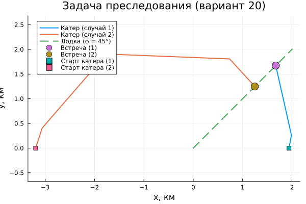

---
## Author
author:
  name: Перегудов Александр Вадимович
  degrees: DSc
  orcid: 0000-0002-0877-7063
  email: 1132239659@rudn.ru
  affiliation:
    - name: Российский университет дружбы народов
      country: Российская Федерация
      postal-code: 117198
      city: Москва
      address: ул. Миклухо-Маклая, д. 6

## Title
title: "Лабораторная работа № 2"
subtitle: "Математическое моделирование"
license: "CC BY"
---

# Цель работы

Исследовать математическую модель задачи преследования на море, вывести дифференциальные уравнения, описывающие траекторию движения катера относительно лодки, реализовать численное решение этих уравнений в среде Julia.



# Задание

# Теоретическое введение

# Выполнение лабораторной работы

Написал скрипт для решения задачи о погоне. ([рис. @fig:001])

{#fig:001 width=70%}

Запустил скрипт. ([рис. @fig:003, @fig:002])

{#fig:003 width=70%}

{#fig:002 width=70%}
 
# Выводы

В ходе выполнения лабораторной работы была решена задача преследования.

# Список литературы{.unnumbered}

::: {#refs}
:::
